# Mitkumar-Midterm

## Create an App with Adobe XD design and implement in the Xcode.

  ### > I created the Project by making small changes into organize_app.xd files.

  ### > **I will recommand you to run this project on iPhone 11 and iPhone 12 pro emulator for better visuals.**

# Steps

+ Initially, user will see the Splash Screen with animated logo.

+ After that with navigation controller we will redirect to the Walkthrough 1
+ In the first walkthrough, I created the Common view with 2 Labels and Navigation dots.
+ Here user can see the multiple animation in the Walkthrouh with delay in each animation.
+ Here, user will find the 2 buttons, which will redirect them into different navigation pages.
 # 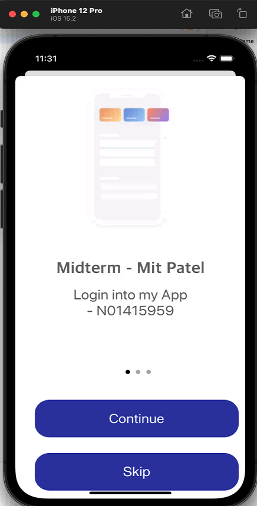

+ If user click on the continue button, then it will redirect to the Walkthrough 2.
 # 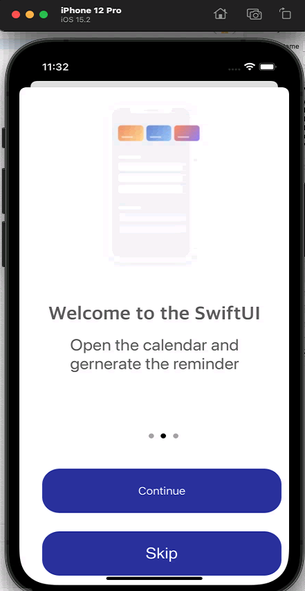

+ In the Walkthrough 2, if user click on the Continue button then it redirect to the Walthrough 3.
+ If user click on the Skip Button in Walthrough 1 or 2, then user will automatically redirect to the Notification Enable Screen(Permission).
+ In the last user will come across with Notification Enable Screen.
  
 # 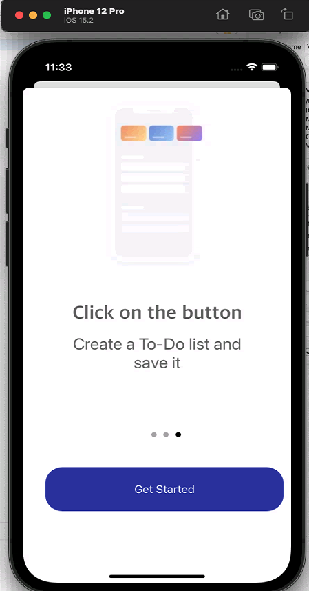 

+ In the Notification Screen, user can see the 3 animations. Two animation are already running once screen appear and if user click on the red icon then the spread anination will be display.
  
 # 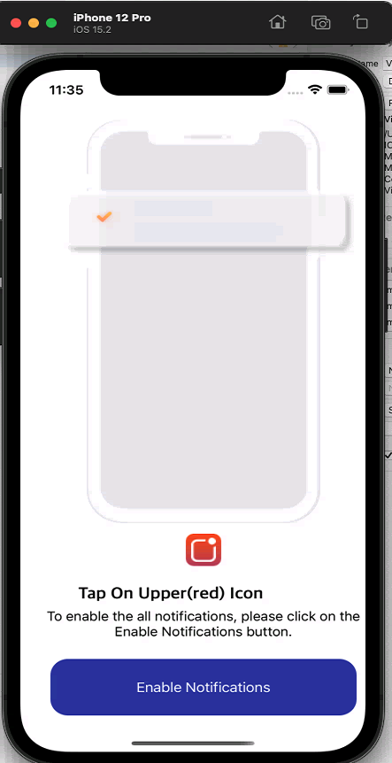

+ If user click on the Enable notification then it will redirect to the Signin Page.
+ Here user need to provide valid name and password. Otherwise it will display error.
+ If user try to click submit button without providing valid name and password then it will pop-up alret.
+ If user enter valid name then the tickmark will be display on right side of text field and if user want to see the password then user can click on the Eye.
  
 # 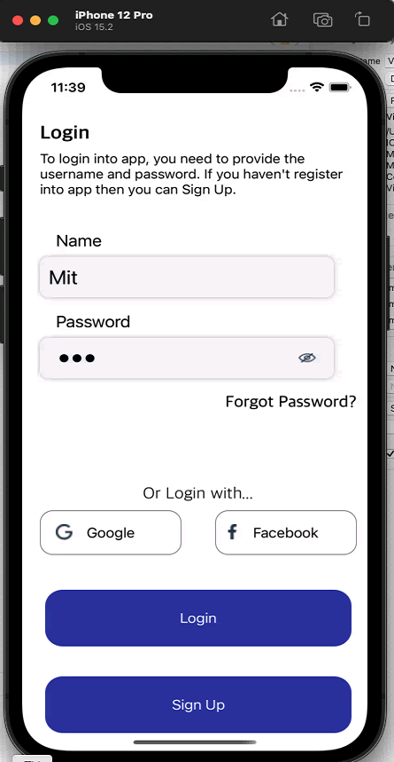                   # 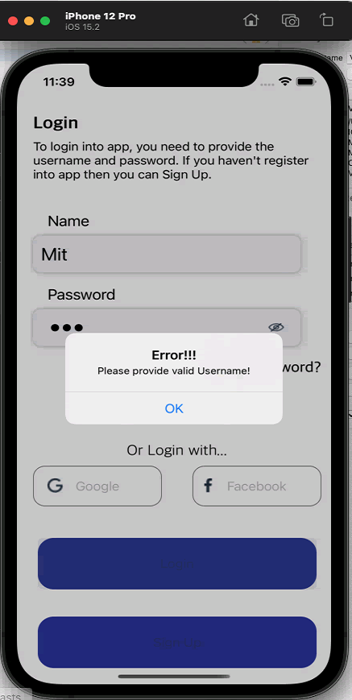                      # 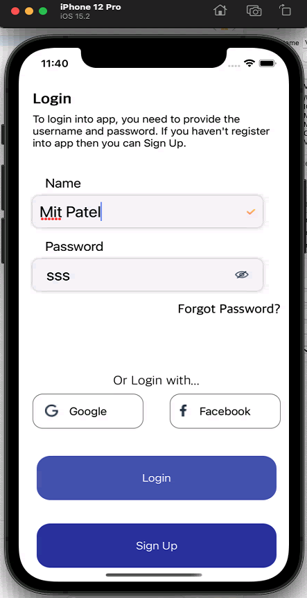

+ If user want to Sign Up first then user can click on Sign Up.
+ In the Sign Up page also we have all validation similar to Login. We have new validation for email.
  
 # 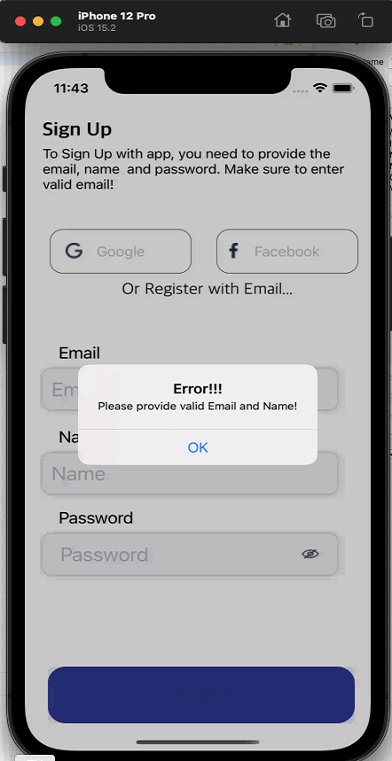                  # 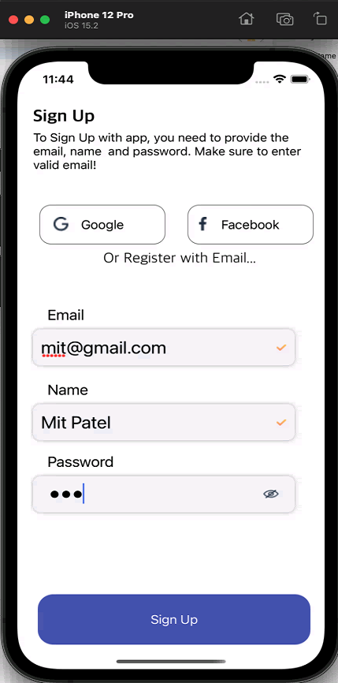

+ After successfully signup, user will see the option for premium account.
 # 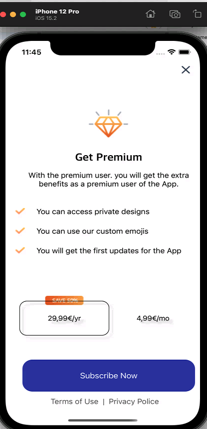                  # 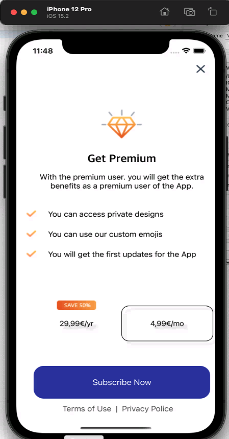

+ In the last user can see 4 tab bar option in which Finance and Setting are implemented successfully.
+ In the Finance Tab, user can see the Views With Animation and if user click on the plus icon then user can see the new account page.
    # 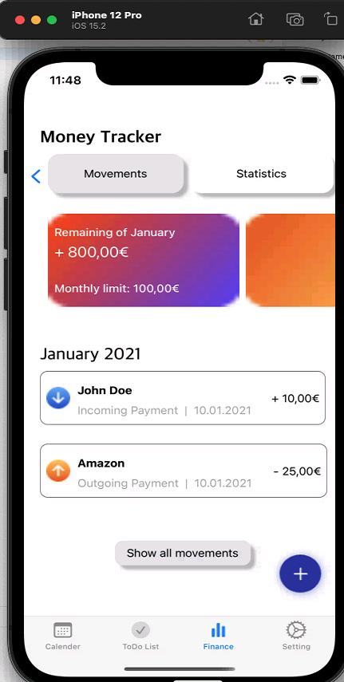                  # 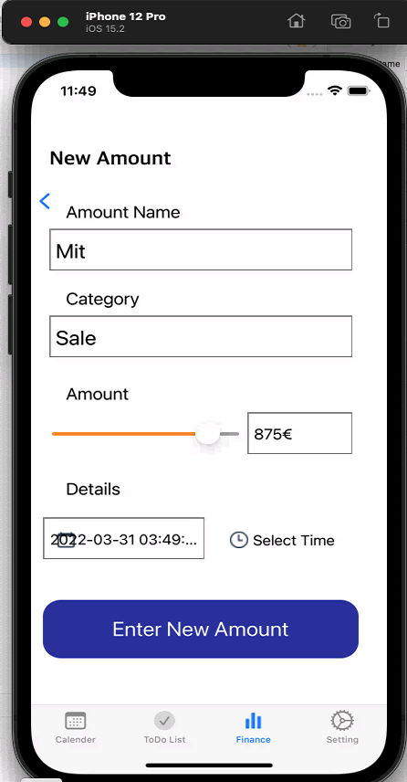

+ Setting Tab view.
     # 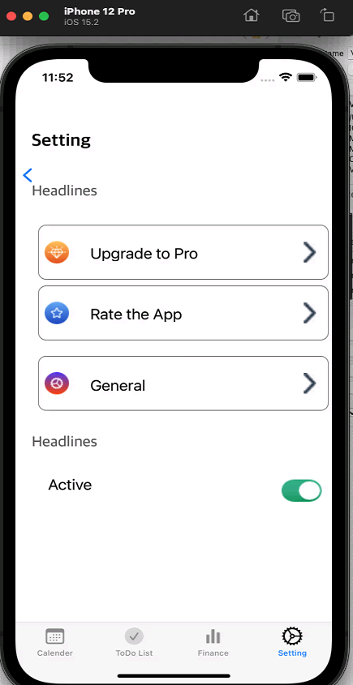

 # 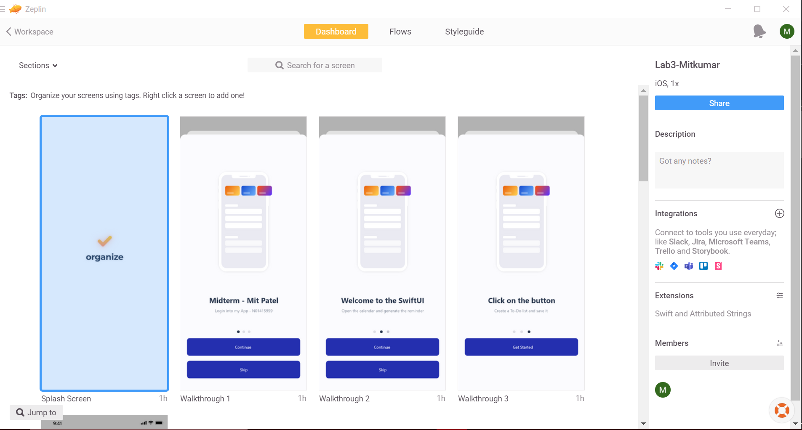        # 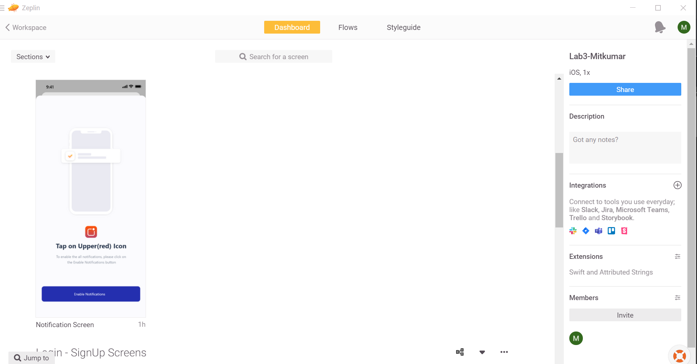

 # 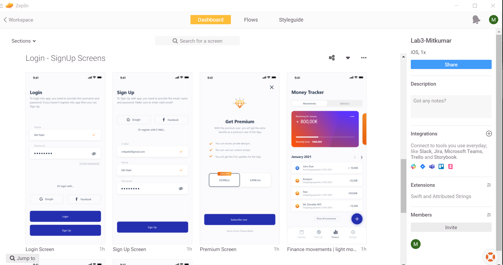        # 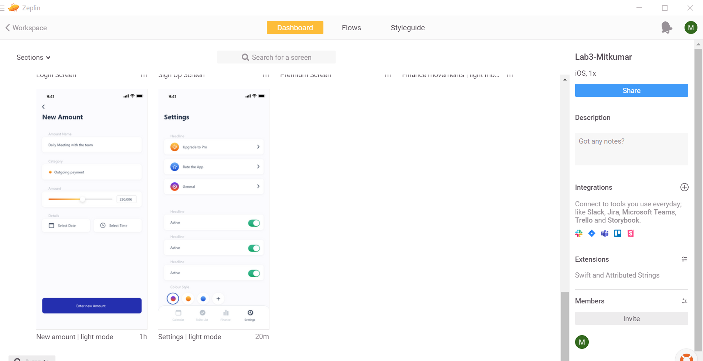

 - For the reference, I am proving the Web View link for the Zeplin.
 - https://scene.zeplin.io/project/62291a8619d07dbdd6fe448c
